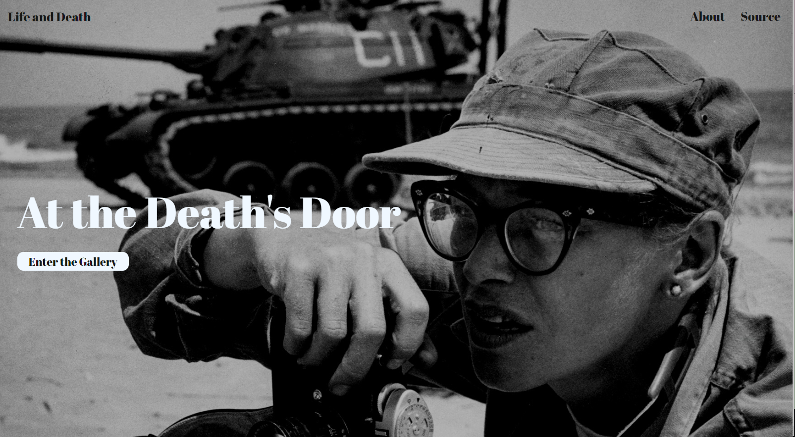
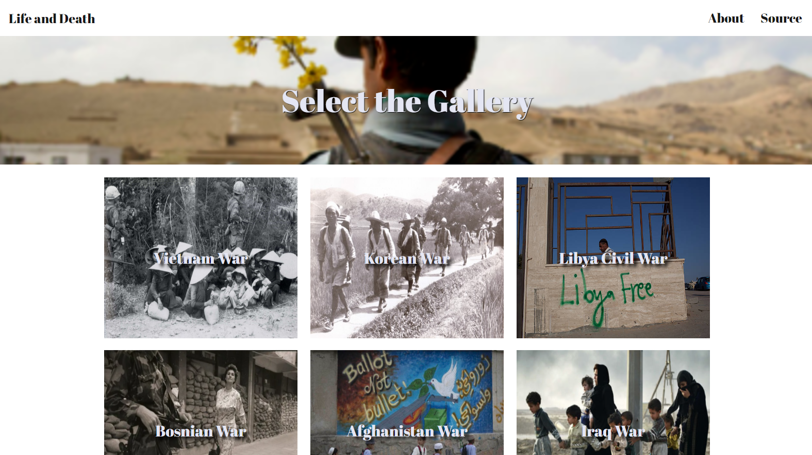
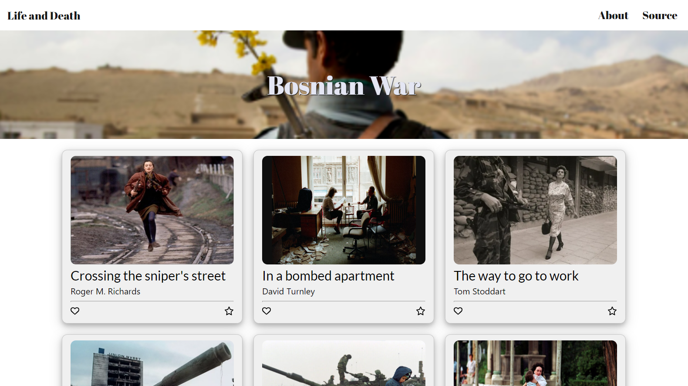

# Life and Death
> 전쟁 사진 온라인 전시회로 각 전쟁 별 사진과 관련 정보에 대해 소개하는 웹서비스

## 목차
- [설치 및 실행](#설치-및-실행)
- [설계](#설계)
- [기능](#기능)
- [구현](#구현)
- [트러블 슈팅](#트러블-슈팅)


## 설치 및 실행

```shell
npm install
npm start
```
`localhost:3000` 접속

## 설계

### 사용

| -             | Link                                                            |
|---------------|-----------------------------------------------------------------|
| Lang          | [TypeScript](https://www.typescriptlang.org/)                          |
| Framework | [React](https://reactjs.org/)                                     |


### 구성 방식
- Main 페이지 : 유저가 가장 먼저 마주하는 페이지로 갤러리에 들어갈 수 있는 버튼, 서비스 소개 페이지와 출처 페이지로 이동할 수 있는 헤더를 개발
- Select 페이지 : 어떤 전쟁의 사진을 볼 것인지 선택할 수 있는 페이지
- Gallery 페이지 : 각 전쟁 별 사진을 나열한 페이지로 모달창을 구현하여 자세한 정보를 볼 수 있는 페이지


## 기능

### 반응형

화면 사이즈에 따라 배치 변화
| 반응형                 | 
|---------------------|
|  |

### 모달창

사진 클릭 시, 모달창이 나타나 관련 정보를 보여줄 수 있도록 개발
| 모달창              | 
|----------------------|
|  |


## 구현

| Main 페이지 (/)                 | 
|---------------------|
|  |

| Select 페이지 (/select)                 | 
|---------------------|
|  |

| Gallery 페이지 (/gallery)                 | 
|---------------------|
|  |
